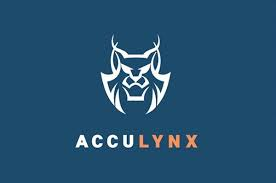

#  Acculynx

Manage roofing contractor business operations including jobs, contacts, estimates, invoices, and payments. Create and search jobs with milestone tracking, assign representatives, and monitor job lifecycle events. Create and retrieve contacts with communication logging. Access estimates, supplements, and financial worksheets. Create and manage invoices, payments, and expenses. Schedule and update appointments via calendars. Upload documents, photos, and videos to jobs. Retrieve company settings such as insurance companies, lead sources, milestones, and trade types. Access reports and manage webhook subscriptions for real-time event notifications on job, contact, and financial changes.

## License

This integration is licensed under the [AGPL-3.0 License](https://www.gnu.org/licenses/agpl-3.0.html).

  Built with ❤️ by <a href="https://metorial.com">Metorial</a>

