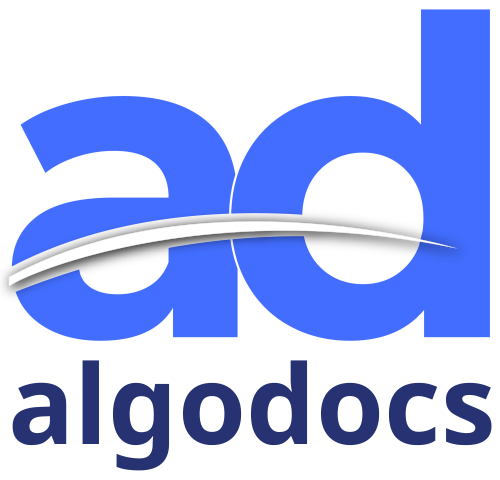

#  Algodocs

Extract structured data from PDFs, images, Word, and Excel documents using AI-powered OCR and custom extractors. Upload documents via local file, URL, or base64 encoding. Manage extractors and folders. Retrieve extracted fields and table data by document or extractor ID, with filtering by folder, date, and limit. Export extracted data in Excel, JSON, XML, or custom Excel templates. Supports over 200 languages.

## License

This integration is licensed under the [AGPL-3.0 License](https://www.gnu.org/licenses/agpl-3.0.html).

  Built with ❤️ by <a href="https://metorial.com">Metorial</a>

