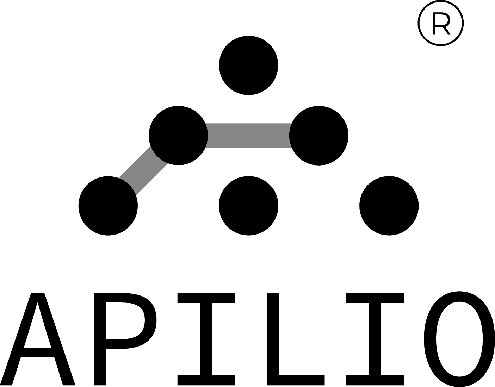

#  Apilio

Manage smart home automation logic by creating and updating variables (boolean, string, numeric), evaluating conditions, and triggering logicblocks. Set, toggle, or clear variable values to reflect device states or contextual information. Retrieve and evaluate conditions that compare variables against expected states using AND/OR/NOT logic. Trigger, activate, or deactivate logicblocks that execute action chains — including delayed actions, cross-brand device commands, and outgoing webhooks — based on positive or negative evaluation results. Coordinate devices across brands like Tuya, Philips Hue, Sonoff, and Tado through complex multi-condition automation.

## License

This integration is licensed under the [AGPL-3.0 License](https://www.gnu.org/licenses/agpl-3.0.html).

  Built with ❤️ by <a href="https://metorial.com">Metorial</a>

