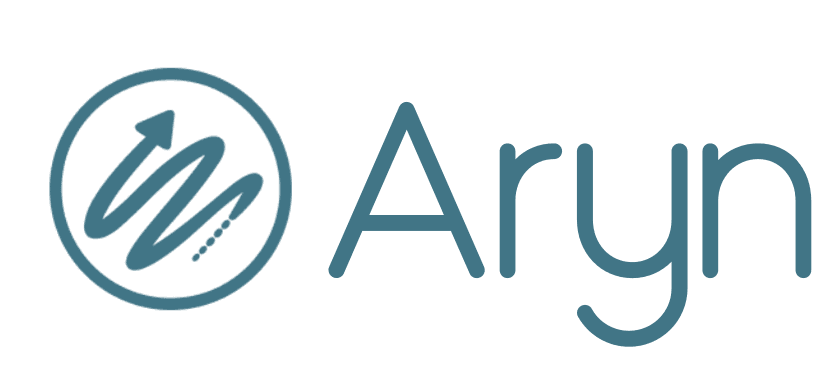

#  Aryn

Parse, segment, and extract structured data from 30+ document types including PDFs and Office files. Convert complex documents into structured JSON, Markdown, or HTML with labeled bounding boxes for titles, tables, images, and text. Extract tables with cell-level content, run OCR in multiple languages, and summarize images. Store parsed documents in DocSets, extract metadata properties as key-value pairs using GenAI, and search across documents and metadata with vector and keyword search. Analyze document collections using natural language queries in deep analytics workspaces. Supports chunking strategies, asynchronous processing for large collections, and property-based filtering.

## License

This integration is licensed under the [AGPL-3.0 License](https://www.gnu.org/licenses/agpl-3.0.html).

  Built with ❤️ by <a href="https://metorial.com">Metorial</a>

