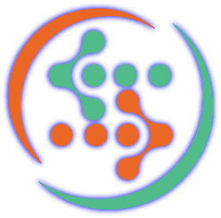

#  Astica Ai

Analyze images using computer vision for object detection, face detection, OCR, content moderation, tagging, and GPT-powered descriptions. Generate AI images from text prompts. Convert text to speech with 500+ voices, voice cloning, and multilingual support. Transcribe speech to text from audio files or streams. Generate natural language text using GPT-S for question answering, content creation, and diverse text generation. Upscale images using AI enhancement. Train and run custom AI models for vision and NLP tasks.

## License

This integration is licensed under the [AGPL-3.0 License](https://www.gnu.org/licenses/agpl-3.0.html).

  Built with ❤️ by <a href="https://metorial.com">Metorial</a>

