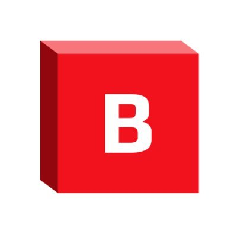

#  Browserbase

Create and manage cloud-hosted headless browser sessions for web automation. Configure sessions with proxy settings, regional selection, timeouts, and stealth mode for anti-detection. Persist browser state (cookies, localStorage, authentication tokens) across sessions using contexts. Upload Chrome extensions and files to sessions, and retrieve downloaded files. Monitor and debug sessions via CDP logs, session recordings, and live debugger URLs. Retrieve project usage data including browser minutes and proxy bytes consumed.

## License

This integration is licensed under the [AGPL-3.0 License](https://www.gnu.org/licenses/agpl-3.0.html).

  Built with ❤️ by <a href="https://metorial.com">Metorial</a>

