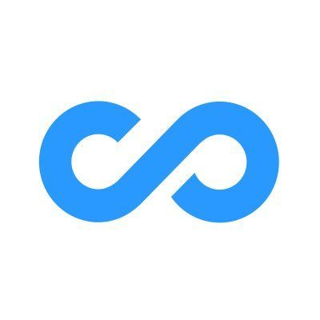

#  Connecteam

Manage workforce operations for deskless employees across operations, communications, and HR hubs. Create, update, archive, and sync employee/user profiles with custom fields and Smart Groups. Track employee time clock activities including clock-in/out, breaks, geofence-based tracking, and timesheet totals. Manage time-off policies, balances, and requests. Create and manage shift schedules with auto-assign, shift layers, and employee unavailability. Create and organize jobs and sub-jobs for scheduling and time tracking. Retrieve forms and form submissions for data collection workflows. Manage Quick Tasks with boards, labels, sub-tasks, and user assignments. Send private chat messages via custom publishers. Manage onboarding packs and assignments. Upload file attachments for use across platform features. Receive real-time webhook notifications for user changes, time activities, form submissions, scheduler events, and task completions.

## License

This integration is licensed under the [AGPL-3.0 License](https://www.gnu.org/licenses/agpl-3.0.html).

  Built with ❤️ by <a href="https://metorial.com">Metorial</a>

