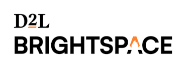

#  D 2 L Brightspace

Manage a Brightspace Learning Management System (LMS) for K–12, higher education, and corporate training. Create and manage users, courses, enrollments, and organizational structures. Handle grades, assignments, quizzes, and discussion forums. Create and organize course content modules and topics. Manage calendar events, announcements, awards, groups, sections, and learning outcomes. Submit and retrieve assignment submissions with feedback. Configure LTI tool integrations and SIS connections. Access bulk data exports for reporting and analytics. Manage ePortfolios, release conditions, checklists, notifications, and role-based permissions. Receive real-time webhook events for user activity, content interactions, grade changes, quiz submissions, enrollments, and session events.

## License

This integration is licensed under the [AGPL-3.0 License](https://www.gnu.org/licenses/agpl-3.0.html).

  Built with ❤️ by <a href="https://metorial.com">Metorial</a>

