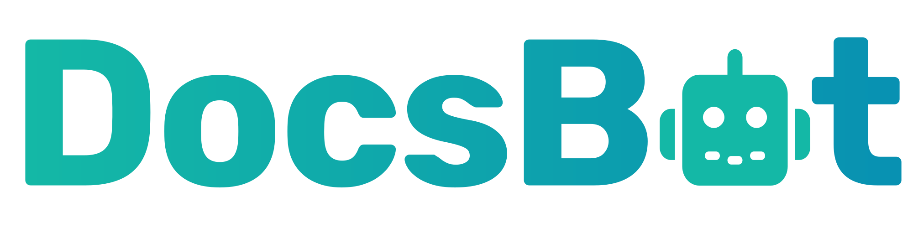

#  Docs Bot Ai

Create and manage custom AI chatbots trained on your own documentation, websites, and content sources. Manage teams, bots, and training sources programmatically. Chat with AI agents via multi-turn conversations with streaming responses, multimodal inputs, and support escalation. Upload documents and files as training sources. Rate answers, track question and conversation history, and retrieve full conversation sessions with metadata and user feedback. Configure bot settings including AI model, language, custom prompts, and branding.

## License

This integration is licensed under the [AGPL-3.0 License](https://www.gnu.org/licenses/agpl-3.0.html).

  Built with ❤️ by <a href="https://metorial.com">Metorial</a>

