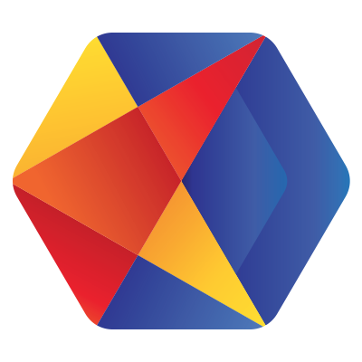

#  Kraken.io

Optimize and compress images in JPG, PNG, WebP, GIF, SVG, AVIF, HEIC, and PDF formats. Perform lossy or lossless compression with custom quality settings. Resize images using multiple strategies (exact, portrait, landscape, auto, crop, square, fit) and generate responsive image sets. Convert images between formats (JPEG, PNG, GIF, WebP, AVIF). Preserve or strip image metadata (EXIF, XMP, IPTC). Auto-correct image orientation. Store optimized images to external cloud providers (S3, Azure, Google Cloud Storage, SoftLayer). Compress PDF files. Query account status for quota and plan details. Receive webhook notifications when optimization completes.

## License

This integration is licensed under the [AGPL-3.0 License](https://www.gnu.org/licenses/agpl-3.0.html).

  Built with ❤️ by <a href="https://metorial.com">Metorial</a>

