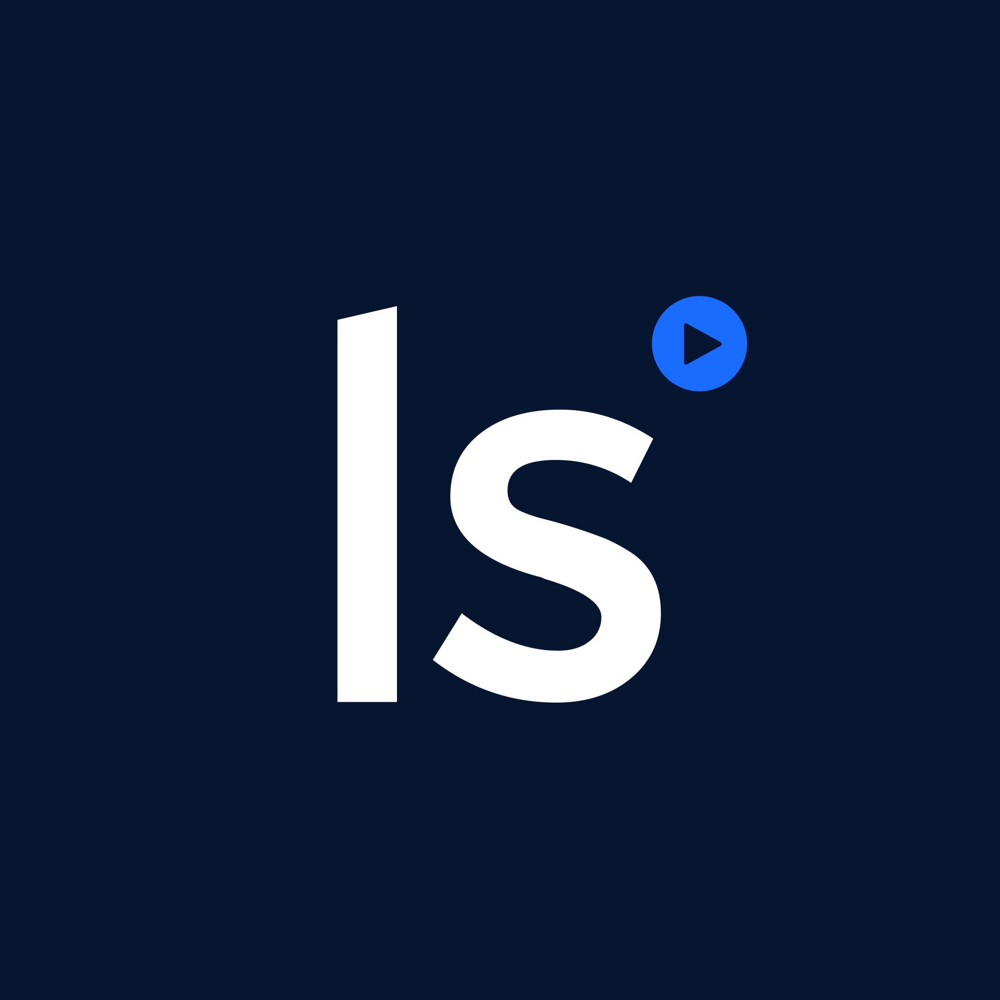

#  Livesession

Access and manage product analytics data from LiveSession's session replay platform. Retrieve user session data including visitor information, geolocation, and custom parameters. Create, update, delete, and compute conversion funnels with multi-step filters and flexible date ranges. Manage custom metrics, dashboards, alerts, websites, and webhook configurations. Export user and event data to CSV or JSON. Receive real-time webhook notifications for JavaScript errors, network errors, error clicks, rage clicks, and custom events occurring during user sessions.

## License

This integration is licensed under the [AGPL-3.0 License](https://www.gnu.org/licenses/agpl-3.0.html).

  Built with ❤️ by <a href="https://metorial.com">Metorial</a>

