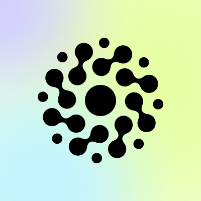

#  Mem 0

Store, retrieve, search, and manage persistent memories for AI applications across users, agents, and sessions. Add memories from conversations with automatic fact extraction or direct storage. Search memories using natural language with semantic similarity and advanced filtering. Manage graph-based memories with entity relationships and multi-hop reasoning. Organize memories with custom categories and instructions. Support multimodal content including images, PDFs, and markdown. Manage entities (users, agents, apps, runs), export memory data, and configure webhooks for memory event notifications.

## License

This integration is licensed under the [AGPL-3.0 License](https://www.gnu.org/licenses/agpl-3.0.html).

  Built with ❤️ by <a href="https://metorial.com">Metorial</a>

