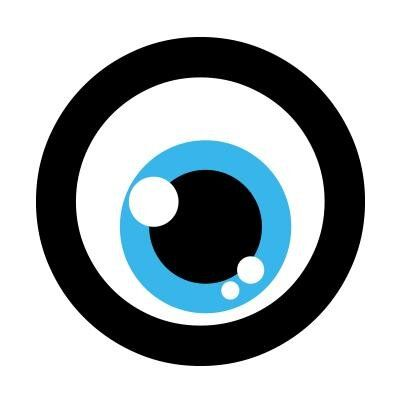

#  Moco

Manage projects, time tracking, invoicing, and CRM for agencies and service businesses. Create and update projects with budgets, tasks, and staff assignments. Log time entries (activities) against project tasks for billable and non-billable hours. Manage companies, contacts, deals, and sales pipelines. Create and send invoices, track payments, and handle invoice reminders. Generate offers/proposals with digital client approval workflows. Manage purchases, expenses, and receipts. Schedule resources and plan team capacity across projects. Administer users, employment details, absences, leave requests, and clock-in/clock-out presences. Retrieve project reports with budget progress, hours logged, and cost breakdowns. Configure custom properties, hourly rates, tags, and account settings. Subscribe to webhooks for real-time notifications on activities, companies, contacts, projects, invoices, offers, deals, expenses, and purchases.

## License

This integration is licensed under the [AGPL-3.0 License](https://www.gnu.org/licenses/agpl-3.0.html).

  Built with ❤️ by <a href="https://metorial.com">Metorial</a>

