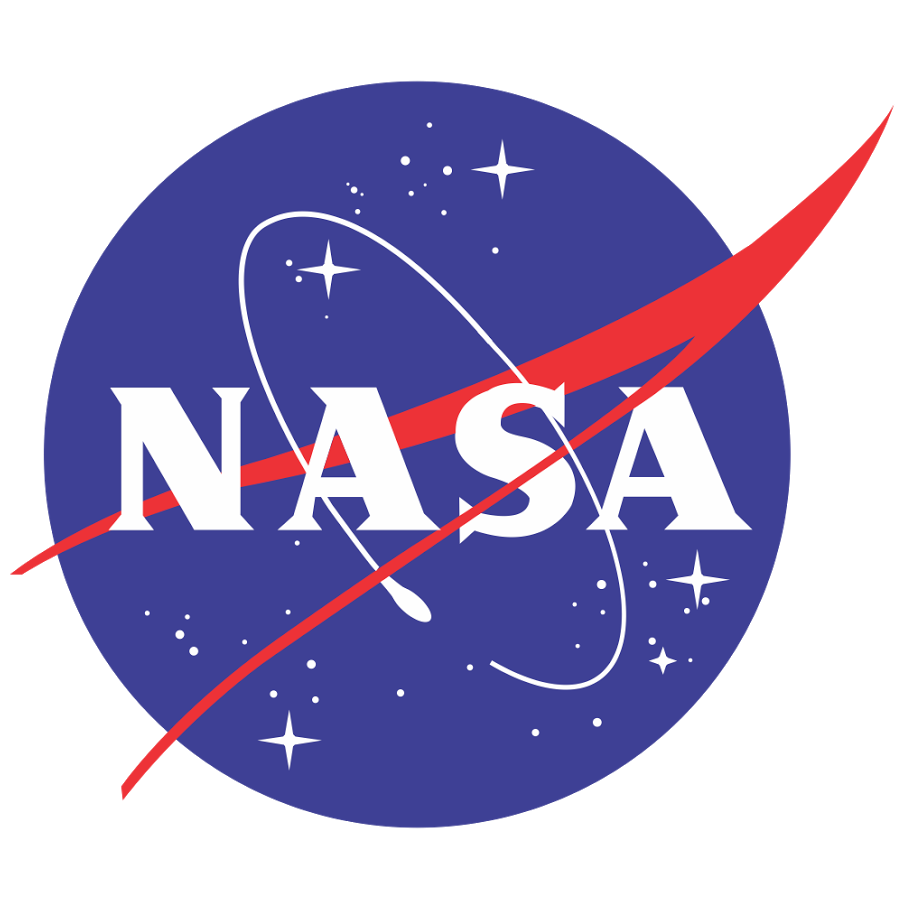

#  Nasa

Access NASA's extensive collection of space and Earth science data, imagery, and metadata. Retrieve the Astronomy Picture of the Day (APOD) with explanations. Search near-Earth asteroid data including orbits and hazard assessments. Browse Mars rover photos filtered by sol, date, and camera. View Earth imagery from EPIC and satellite observations by coordinates. Track natural events (wildfires, storms, volcanoes) via EONET. Query space weather data including solar flares, coronal mass ejections, and geomagnetic storms from DONKI. Search NASA's image and video library. Look up satellite orbital elements (TLE), NASA technology projects (TechPort), space biology experiments (GeneLab), exoplanet archive data, and solar system dynamics. All APIs are read-only data retrieval services.

## License

This integration is licensed under the [AGPL-3.0 License](https://www.gnu.org/licenses/agpl-3.0.html).

  Built with ❤️ by <a href="https://metorial.com">Metorial</a>

