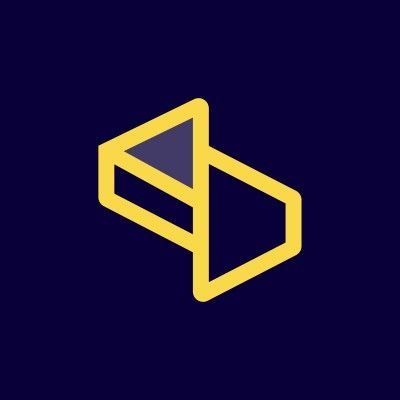

#  Scrape Do

Scrape public web pages and return raw HTML, JSON, or markdown content. Bypass anti-bot protections and CAPTCHAs automatically with rotating proxies across 150 countries. Render JavaScript-heavy pages using a headless browser with configurable wait conditions, viewport settings, and simulated user interactions. Capture screenshots of web pages. Extract structured product data from Amazon (product details, offers, search results) across 21 marketplaces. Scrape Google Search results and return structured JSON with organic results, ads, knowledge graphs, local packs, and more across 84 Google domains. Run large-scale asynchronous scraping jobs with webhook delivery. Manage geo-targeting, session persistence, device emulation, and custom headers/cookies for all requests. Use as a standard HTTP proxy compatible with Scrapy, Selenium, Puppeteer, and Playwright.

## License

This integration is licensed under the [AGPL-3.0 License](https://www.gnu.org/licenses/agpl-3.0.html).

  Built with ❤️ by <a href="https://metorial.com">Metorial</a>

