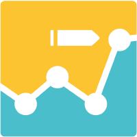

#  Segmetrics

Import and retrieve marketing attribution and analytics data. Create, update, and delete contacts with UTM parameters, tags, and custom fields. Manage orders/invoices with line items and refund status. Create and manage subscriptions with billing cycle configuration. Track ad performance including spend, clicks, and impressions across campaigns, ad sets, and ads. Retrieve saved reports for leads, revenue, ads, and subscriptions with KPIs, time series graphs, and tabular breakdowns. Access full customer journey data including page views, tags, orders, and attribution touchpoints. Identify website visitors and link them to CRM contacts.

## License

This integration is licensed under the [AGPL-3.0 License](https://www.gnu.org/licenses/agpl-3.0.html).

  Built with ❤️ by <a href="https://metorial.com">Metorial</a>

