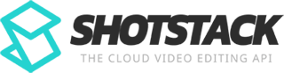

#  Shotstack

Programmatically edit and generate videos, images, and audio using a JSON-based timeline model. Arrange clips with transitions, effects, filters, and overlays. Create reusable templates with merge fields for mass video personalization. Ingest and transform source assets (resize, convert formats, adjust frame rates). Host and distribute rendered assets via CDN or to AWS S3, Google Cloud Storage, Google Drive, Mux, and Vimeo. Generate AI-powered assets including text-to-image, text-to-speech, image-to-video, text generation, talking avatars (D-ID), realistic voice synthesis (ElevenLabs), and Stable Diffusion image generation. Inspect media file metadata such as format, duration, and codecs. Receive webhook callbacks for render, hosting, and ingestion completion events.

## License

This integration is licensed under the [AGPL-3.0 License](https://www.gnu.org/licenses/agpl-3.0.html).

  Built with ❤️ by <a href="https://metorial.com">Metorial</a>

