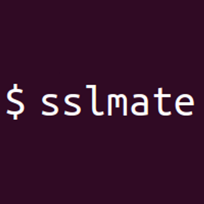

#  Sslmate Cert Spotter API

Monitor Certificate Transparency logs to detect SSL/TLS certificates issued for your domains. Search for certificates by domain name, including subdomains, with deduplication and incremental querying. Manage monitored domains by adding, removing, enabling, or disabling them. Authorize known certificates and public keys to reduce alert noise from legitimate renewals. Receive webhook notifications when unknown certificates are detected or new endpoints are discovered.

## License

This integration is licensed under the [AGPL-3.0 License](https://www.gnu.org/licenses/agpl-3.0.html).

  Built with ❤️ by <a href="https://metorial.com">Metorial</a>

