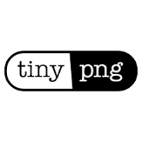

#  Tiny Png

Compress AVIF, WebP, JPEG, and PNG images using lossy compression while preserving visual quality. Resize images using scale, fit, cover, and thumb methods. Convert images between AVIF, WebP, JPEG, and PNG formats. Preserve image metadata such as copyright, creation date, and GPS location. Save optimized images directly to Amazon S3 or Google Cloud Storage buckets. Track monthly compression usage.

## License

This integration is licensed under the [AGPL-3.0 License](https://www.gnu.org/licenses/agpl-3.0.html).

  Built with ❤️ by <a href="https://metorial.com">Metorial</a>

